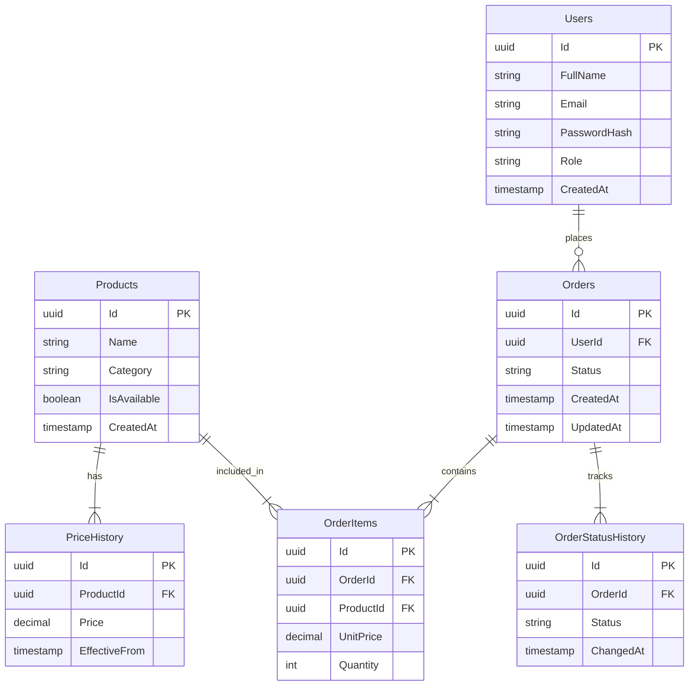

# 🥖 Bakery Management API

A RESTful API for managing bakery orders, products, and pricing history.

Built with **ASP.NET Core 8**, **PostgreSQL**, and **Entity Framework Core**.

---

## 🛠 Tech Stack

- **Language:** C#
- **Framework:** ASP.NET Core 8 Web API
- **Database:** PostgreSQL + Entity Framework Core
- **Auth:** JWT Bearer Token
- **Password hashing:** BCrypt

---

## 📐 Database Schema



---

## 🚀 Features

- JWT authentication & authorization
- Product management with price history
- Order lifecycle tracking with status history
- Daily reports — top products, total revenue

---

## ⚙️ Getting Started

```bash
# Clone the repo
git clone https://github.com/TemurbekUbaydullayev/bakery-management-api.git

# Run migrations
dotnet ef database update

# Start the API
dotnet run
```